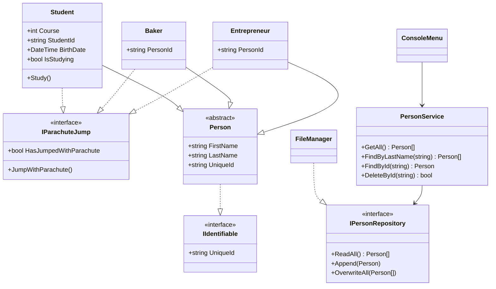

# Діаграма класів

```mermaid
classDiagram
    class IIdentifiable {
        <<interface>>
        +string UniqueId
    }

    class IParachuteJump {
        <<interface>>
        +bool HasJumpedWithParachute
        +JumpWithParachute()
    }

    class Person {
        <<abstract>>
        +string FirstName
        +string LastName
        +string UniqueId
    }

    class Student {
        +int Course
        +string StudentId
        +DateTime BirthDate
        +bool IsStudying
        +Study()
    }

    class Baker {
        +string PersonId
    }

    class Entrepreneur {
        +string PersonId
    }

    class IPersonRepository {
        <<interface>>
        +ReadAll() Person[]
        +Append(Person)
        +OverwriteAll(Person[])
    }

    class FileManager
    class PersonService {
        +GetAll() Person[]
        +FindByLastName(string) Person[]
        +FindById(string) Person
        +DeleteById(string) bool
    }

    class ConsoleMenu

    Person ..|> IIdentifiable
    Student --|> Person
    Baker --|> Person
    Entrepreneur --|> Person
    Student ..|> IParachuteJump
    Baker ..|> IParachuteJump
    Entrepreneur ..|> IParachuteJump
    FileManager ..|> IPersonRepository
    PersonService --> IPersonRepository
    ConsoleMenu --> PersonService
```
