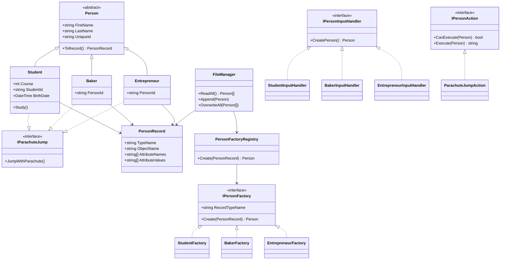

# Діаграма класів

## Розширення без зміни існуючих класів

Щоб додати новий тип особи, потрібно створити лише новий клас-нащадок `Person`, його фабрику
`IPersonFactory` та обробник введення `IPersonInputHandler`. Реєстри знаходять їх автоматично,
тому `FileManager`, `ConsoleMenu` і вже створені класи не потрібно змінювати.

Щоб додати нову дію, потрібно створити новий клас `IPersonAction`. Меню також знайде його
автоматично та покаже окремим пунктом.
