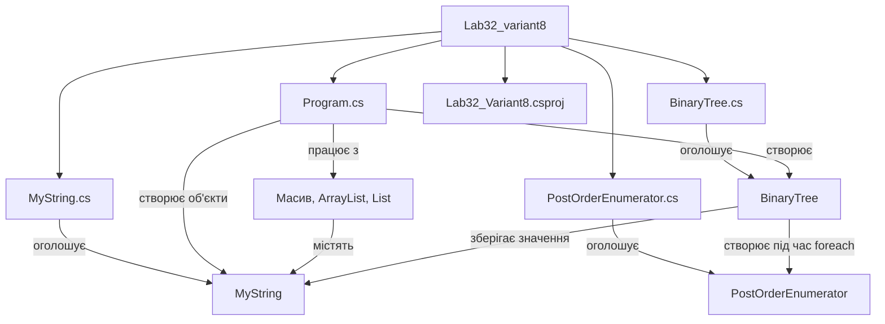
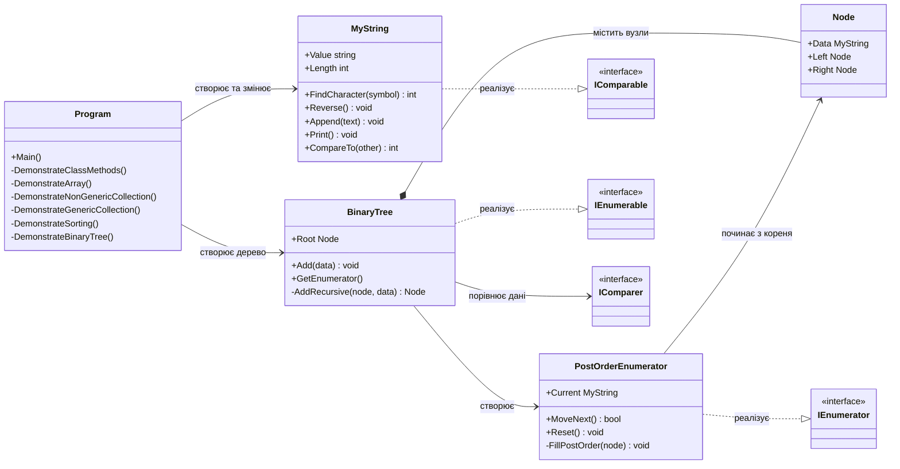

# Концептуальна схема проєкту Lab32_variant8

## Призначення файлів

| Файл | Призначення |
| --- | --- |
| `Program.cs` | Точка входу. Створює об'єкти, демонструє роботу класу, колекцій, сортування та дерева. |
| `MyString.cs` | Оголошує клас `MyString` для зберігання та обробки рядка. |
| `BinaryTree.cs` | Оголошує узагальнене бінарне дерево `BinaryTree<T>` і вкладений вузол `Node`. |
| `PostOrderEnumerator.cs` | Оголошує ітератор `PostOrderEnumerator<T>` для обходу дерева в postorder. |
| `Lab32_Variant8.csproj` | Налаштовує .NET-консольний проєкт та цільову платформу. |

## Зв’язки між файлами й сутностями

## Схема класів та інтерфейсів

## Як працюють основні частини

1. `Program.Main` створює чотири об'єкти `MyString` і послідовно викликає методи демонстрації.
2. `MyString` зберігає рядок у `Value`; методи класу шукають символ, розвертають рядок, додають текст і виводять дані.
3. `MyString` реалізує `IComparable`, тому його об'єкти можна сортувати та порівнювати під час вставлення у дерево.
4. `Program` використовує три способи зберігання об'єктів: масив, `ArrayList` і `List<MyString>`.
5. `BinaryTree` додає кожен об'єкт у вузол `Node`: менше значення переходить ліворуч, більше або рівне — праворуч.
6. Під час `foreach` дерево повертає `PostOrderEnumerator`. Ітератор формує послідовність: ліве піддерево, праве піддерево, корінь.

## Ланцюжок обходу дерева

```mermaid
flowchart LR
    Loop[foreach по BinaryTree] --> GetEnumerator[BinaryTree.GetEnumerator]
    GetEnumerator --> CreateEnumerator[Створення PostOrderEnumerator]
    CreateEnumerator --> Fill[FillPostOrder від кореня]
    Fill --> Left[Ліве піддерево]
    Left --> Right[Праве піддерево]
    Right --> Root[Корінь]
    Root --> Items[Список елементів у postorder]
    Items --> MoveNext[MoveNext та Current]
    MoveNext --> Output[Виведення MyString.Print]
```

