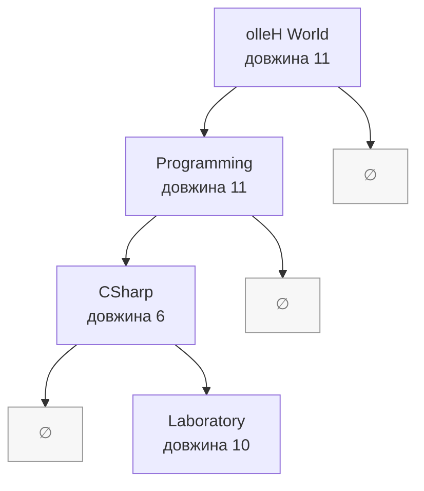

# Лабораторна робота 3.2 — варіант 8

1. Клас `MyString`:
   - `Value` — значення рядка;
   - `Length` — довжина;
   - пошук заданого символу;
   - розворот рядка;
   - додавання нового рядка;
   - виведення рядка.

2. Створено 4 об'єкти та показано роботу з:
   - масивом `MyString[]`;
   - non-generic колекцією `ArrayList`;
   - Generic-колекцією `List<MyString>`.

   Також продемонстровано:
   - додавання;
   - видалення;
   - оновлення;
   - пошук;
   - прохід по елементах.

3. Реалізовано узагальнене бінарне дерево `BinaryTree<T>`.

4. Реалізовано:
   - `IComparable<MyString>`;
   - сортування через `List.Sort()`;
   - власний ітератор `PostOrderEnumerator<T>` через `IEnumerator<T>`;
   - `IEnumerable<T>` у дереві;
   - обхід дерева за варіантом 8: **postorder**.

## Структура:

```text
Lab32_Variant8/
├── Lab32_Variant8.csproj
├── Program.cs
├── MyString.cs
├── BinaryTree.cs
├── PostOrderEnumerator.cs
└── README.md
```


## Блок-схема роботи програми

```mermaid
flowchart TD
    A([Початок]) --> B[Налаштувати кодування UTF-8]
    B --> C[Створити s1=Hello, s2=Programming,<br/>s3=CSharp, s4=Laboratory]

    C --> D[DemonstrateClassMethods s1]
    D --> D1[Вивести Hello та знайти l]
    D1 --> D2[Reverse: Hello → olleH]
    D2 --> D3[Append: olleH → olleH World]

    D3 --> E[DemonstrateArray]
    E --> E1[Створити MyString[] із s1, s2, s3, s4]
    E1 --> E2[Додати AddedToArray:<br/>створити новий більший масив]
    E2 --> E3[Замінити елемент 0 на UpdatedArrayItem]
    E3 --> E4{Programming<br/>знайдено?}
    E4 -->|так| E5[Вивести індекс]
    E4 -->|ні| E6[Вивести повідомлення]
    E5 --> E7[Видалити елемент 1:<br/>створити новий менший масив]
    E6 --> E7

    E7 --> F[DemonstrateNonGenericCollection]
    F --> F1[Створити ArrayList із тих самих<br/>об'єктів s1–s4]
    F1 --> F2[Add → заміна елемента 0 → пошук<br/>Programming → RemoveAt 1]

    F2 --> G[DemonstrateGenericCollection]
    G --> G1[Створити List&lt;MyString&gt; із s1–s4]
    G1 --> G2[Add → заміна елемента 0 → FindIndex<br/>Programming → RemoveAt 1]

    G2 --> H[DemonstrateSorting]
    H --> H1[Створити нові копії значень s1–s4]
    H1 --> H2[List.Sort викликає MyString.CompareTo]
    H2 --> H3[Порівняння: спершу за довжиною,<br/>за однакової довжини — за текстом]

    H3 --> I[DemonstrateBinaryTree]
    I --> I1[Створити BinaryTree&lt;MyString&gt;<br/>та додати копії значень s1–s4]
    I1 --> I2[AddRecursive: менше → ліворуч,<br/>більше або рівне → праворуч]
    I2 --> I3[GetEnumerator створює<br/>PostOrderEnumerator]
    I3 --> I4[Обхід: ліве піддерево → праве піддерево → корінь]

    I4 --> J[Вивести висновки про колекції]
    J --> K([Кінець])
```

Після `DemonstrateClassMethods` об'єкт `s1` вже має значення `olleH World`.
Сам об'єкт додається до масиву, `ArrayList` і `List<MyString>`, а для сортування
та дерева створюються нові `MyString` з його поточного значення. Заміна нульового
елемента в кожній колекції не змінює сам `s1`, тому далі його значення залишається
`olleH World`.

## Схема формування та обходу дерева

`MyString.CompareTo` спочатку порівнює довжину рядків, а якщо довжини однакові —
текст. Тому після вставлення копій `s1`, `s2`, `s3`, `s4` дерево має такий вигляд:



Причина розташування `Programming` ліворуч від `olleH World`: обидва рядки мають
довжину 11, але `Programming` передує `olleH World` за текстовим порівнянням.

Ітератор спершу рекурсивно записує значення у список, а `foreach` по черзі їх
зчитує. Для наведеного дерева результат `postorder` такий:

```text
Laboratory → CSharp → Programming → olleH World
```

```bash
dotnet --version
dotnet build
dotnet run
```
