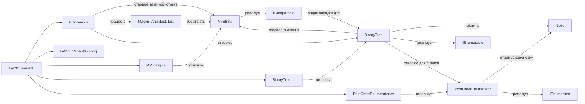

# Лабораторна робота 3.2 — варіант 8

1. Клас `MyString`:
   - `Value` — значення рядка;
   - `Length` — довжина;
   - пошук заданого символу;
   - розворот рядка;
   - додавання нового рядка;
   - виведення рядка.

2. Створено 4 об'єкти та показано роботу з:
   - масивом `MyString[]`;
   - non-generic колекцією `ArrayList`;
   - Generic-колекцією `List<MyString>`.

   Також продемонстровано:
   - додавання;
   - видалення;
   - оновлення;
   - пошук;
   - прохід по елементах.

3. Реалізовано узагальнене бінарне дерево `BinaryTree<T>`.

4. Реалізовано:
   - `IComparable<MyString>`;
   - сортування через `List.Sort()`;
   - власний ітератор `PostOrderEnumerator<T>` через `IEnumerator<T>`;
   - `IEnumerable<T>` у дереві;
   - обхід дерева за варіантом 8: **postorder**.

## Структура:

```text
Lab32_Variant8/
├── Lab32_Variant8.csproj
├── Program.cs
├── MyString.cs
├── BinaryTree.cs
├── PostOrderEnumerator.cs
└── README.md
```


## Концептуальна схема проєкту



`Program.cs` є точкою входу: він створює об'єкти `MyString`, демонструє роботу
колекцій і створює `BinaryTree`. Дерево зберігає `MyString` у вузлах `Node`.
`PostOrderEnumerator` забезпечує обхід дерева в порядку postorder під час
`foreach`.

```bash
dotnet --version
dotnet build
dotnet run
```
