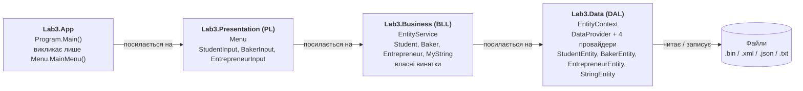
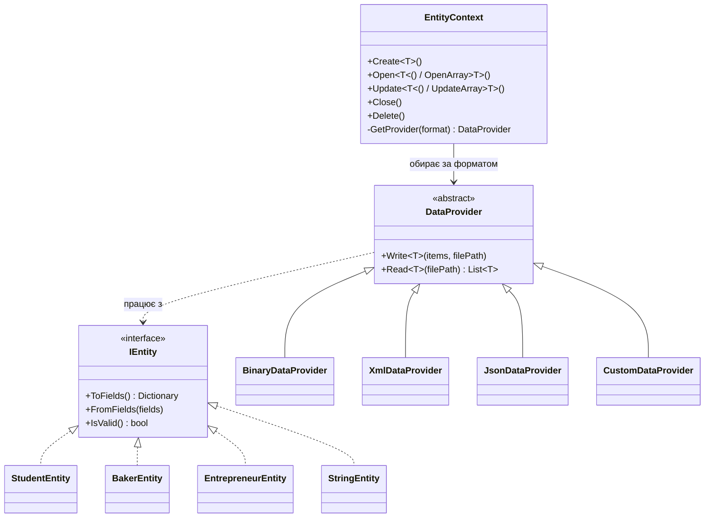
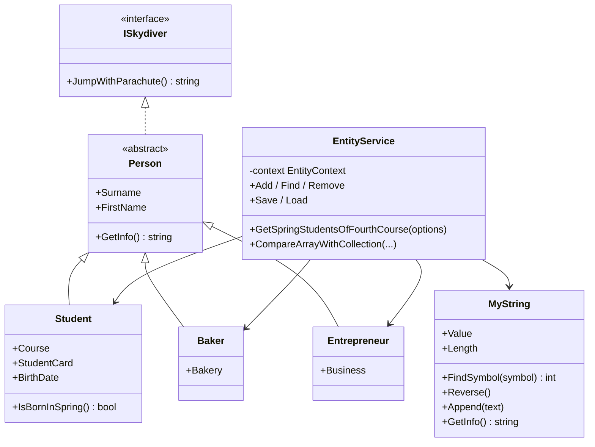
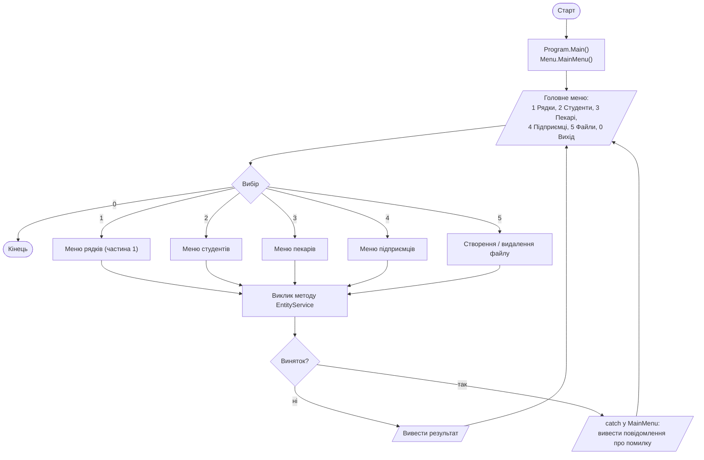
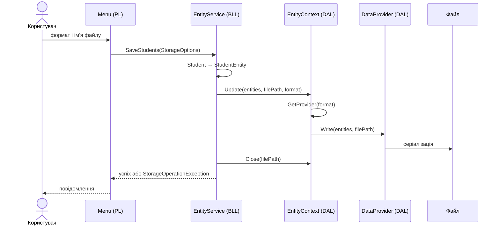
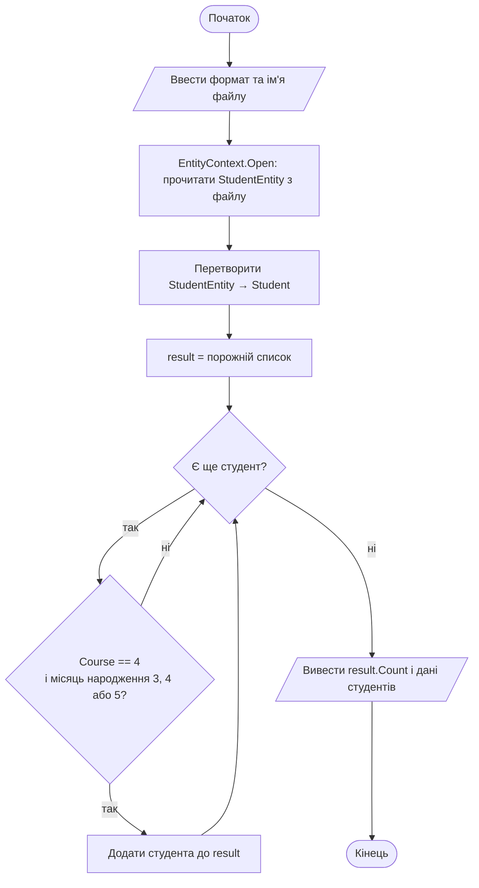
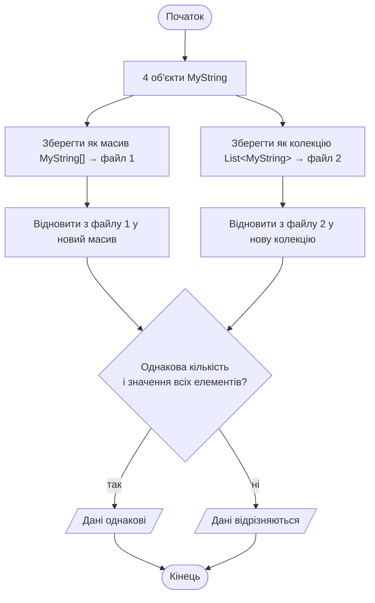
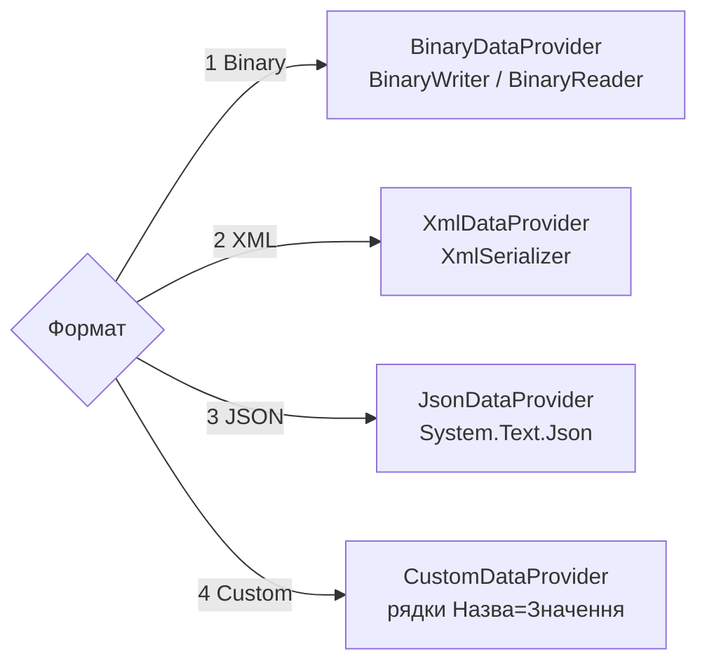

# Лабораторна робота 3.3, варіант 8 — блок-схеми

## 1. Трирівнева архітектура рішення

Кожен проєкт посилається тільки на рівень нижче.

## 2. Класи рівня доступу до даних (DAL)

## 3. Класи рівня бізнес-логіки (BLL)

## 4. Загальна блок-схема роботи програми

## 5. Збереження даних у файл (як рівні взаємодіють)

## 6. Алгоритм: студенти 4-го курсу, які народилися навесні (з файлу)

## 7. Частина 1: серіалізація масиву і колекції, порівняння

## 8. Вибір провайдера серіалізації

